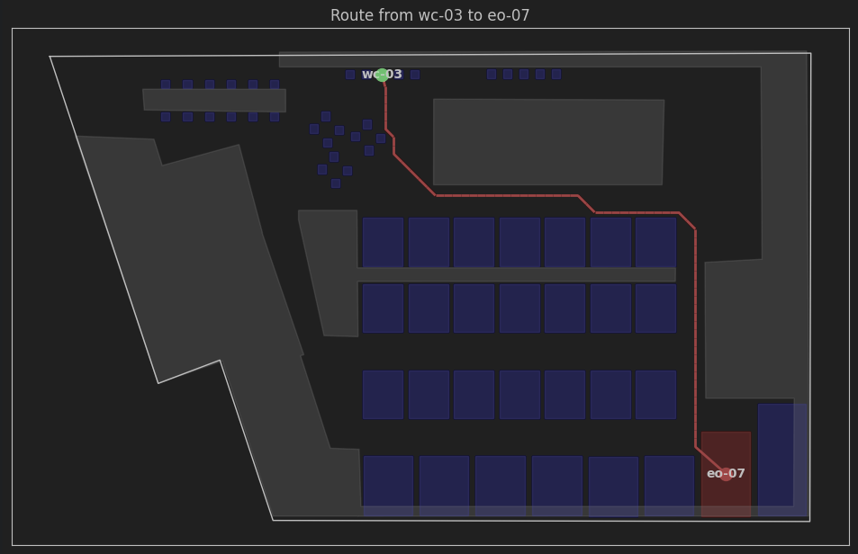

# Learn-SVGRouting

## Description

Learn-SVGRouting is a project designed to extract, analyze, and visualize routing paths from SVG floorplans. It
leverages tools like PostGIS, pgRouting, and various Python libraries to generate walkability graphs based on the layout
of floorplans, obstacles, and desks. This can be useful for applications such as robot navigation in mapped
environments.

Example output:



## Libraries and Dependencies

The project utilizes the following libraries:

- **Matplotlib**: For creating static, interactive, and animated visualizations in Python.
- **NetworkX**: A library for the creation, manipulation, and study of complex networks.
- **Notebook**: A web-based interactive computing environment for creating Jupyter notebooks.
- **NumPy**: A fundamental package for scientific computing in Python, supporting large, multi-dimensional arrays and
  matrices.
- **Psycopg2-binary**: A PostgreSQL adapter for Python, used for connecting to the PostgreSQL database.
- **Shapely**: A library for manipulation and analysis of planar geometric objects.

## Usage

After setting up your environment and installing the dependencies, you can start using the project to extract and
analyze routing paths from SVG floorplans.

## Requirements

- Python 3.12
- PostgreSQL with PostGIS and pgRouting extensions
- Docker (for containerized environment)

## Installation

To set up the project, you can follow these steps:

1. **Clone the repository**:

```bash
git clone https://github.com/shawinnes/learn-svgrouting.git
cd learn-svgrouting
```

2. **Install dependencies**

```bash
uv sync
```

## Next Steps

- Render PostGIS shapes to React App
- Render PostGIS shapes to Vector Tiles
